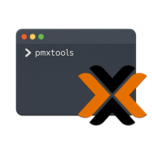

  

<h1 align="center">pmxtools</h1>

  Public release index for the pmxtools suite — Proxmox VE auditing &amp; desktop management tools 
  No source here — pmxtools-cli and pmxtools-ui are closed-source, private repositories

  
  
  
  

---

## Overview

**pmxtools** is a suite of tools for auditing, inventorying and managing Proxmox VE infrastructures. The suite is split into two closed-source applications, each in its own private repository:

| Repository | Type | Description |
|---|---|---|
| `pmxtools-cli` | CLI (Go) | Auditing and inventory tool for Proxmox VE infrastructures via API |
| `pmxtools-ui` | Desktop app (Go + React, Nex framework) | Graphical control panel for monitoring and managing Proxmox VE, built on top of `pmxtools-cli`'s Proxmox client |

This repository contains **no application source code**. It exists only as the public landing point for the suite and as an index of what each private repository releases, so that release history stays visible without exposing the source itself.

---

## Release types

### pmxtools-cli

Single self-contained binary, built per OS/architecture:

| Platform | Artifact |
|---|---|
| Linux (amd64) | `pmxtools-<version>-linux-amd64` |
| Windows (amd64) | `pmxtools-<version>-windows-amd64.exe` |
| macOS (amd64) | `pmxtools-<version>-macos-amd64` |
| macOS (arm64) | `pmxtools-<version>-macos-arm64` |

**Version history:**

| Version | Build |
|---|---|
| 0.1.2 | R170626 |
| 0.1.1 | R120626 |
| 0.1.0 | R100326 |

### pmxtools-ui

Native desktop app, built per OS/architecture and published as a GitHub Release with zipped platform artifacts on every version tag:

| Platform | Artifact |
|---|---|
| macOS (amd64) | `darwin-amd64.zip` |
| macOS (arm64) | `darwin-arm64.zip` |
| Windows (amd64) | `windows-amd64.zip` |
| Linux (amd64) | `linux-amd64.zip` |
| Linux (arm64) | `linux-arm64.zip` |

**Version history:**

| Version | Build |
|---|---|
| 0.1.0 | R140726 |

---

Copyright © 2026 vlT di Veronesi Lorenzo. Tutti i diritti sono riservati.
